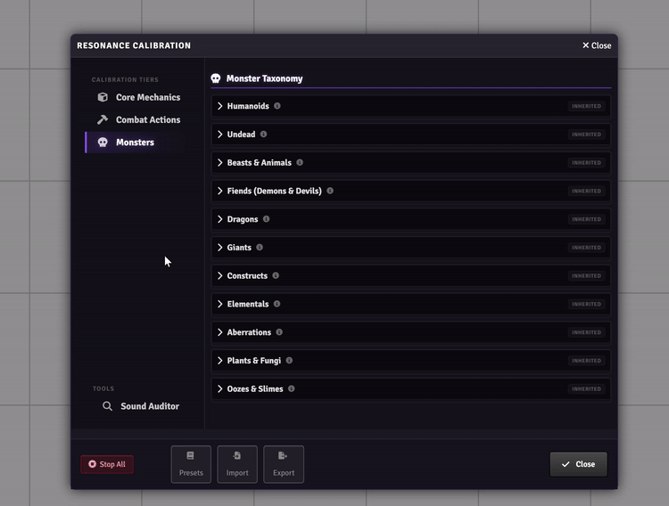

# Ionrift Resonance

**Automated audio triggers for Foundry VTT.**

Triggers sound effects based on chat messages, mechanics, and combat workflows. Supports **[Daggerheart](https://foundryvtt.com/packages/daggerheart)** (official system, native support) and **DnD5e** (via Midi-QOL). Works with **local sound files** (WAV/MP3) out of the box — no paid accounts required. Optionally integrates with **Syrinscape** for cloud-hosted audio.

<table>
<tr>
<td width="50%">
<h3>DnD5e Combat</h3>

<em>🎵 Attack → Hit → Pain vocal (automatic)</em>
</td>
<td width="50%">
<h3>Daggerheart Combat</h3>

<em>🎵 Attack → Hope stinger → Damage → Fear tick</em>
</td>
</tr>
</table>

## Quick Start

1. Install from Foundry VTT package manager
2. Install **Ionrift Library** (required dependency)
3. Run the **Attunement Protocol** (appears on first launch)
   - **Local sounds?** Leave the Syrinscape token blank and click Verify to proceed in Local-Only mode
   - **Syrinscape?** Paste your auth token to connect cloud audio
4. Select a sound preset or start with a blank configuration

## Per-Actor & Per-Item Sound Overrides

Every actor and item sheet includes a **🎵 Sounds** button (header or overflow menu). Click it to:

- **Assign custom attack/spell sounds** to specific items (e.g., "Flaming Longsword" → fire impact)
- **Override PC pain/death vocals** per character (Masculine/Feminine identity selection)
- **Configure monster-specific sounds** (e.g., Dragon breath attack)
- **Set actor-wide defaults** that apply to all their items

**Examples:**
- Assign a unique roar to a specific Dragon NPC
- Give "Elric's Stormblade" a custom thunder impact sound
- Override generic pain sounds with character-specific voice lines

This feature works independently of global presets—your custom bindings always take priority.

## Features
*   **Duality Dice Support**: Recognizes Daggerheart roll mechanics.
    *   **Fear**: Plays dark/tense sounds when Fear interacts with the roll.
    *   **Hope**: Plays heroic/uplifting sounds when Hope prevails.
    *   **Criticals**: Distinct audio cues for rolling doubles (Crits).
*   **Contextual Triggers**:
    *   **Damage**: "Blood splat" sounds when actors take damage.
    *   **Death**: Dramatic cues when an actor takes damage exceeding their max HP.
    *   **Misses**: "Whoosh" or failure sounds on missed attacks.
*   **Smart Matching**: Automatically picks sounds based on weapon names (Sword, Dagger, Bow) or spell keywords (Fire, Ice, Void).

## Resonance Calibration

### Sound Picker

  
*Search sounds → preview → select (supports local files and Syrinscape)*

### Tier Navigation

  
*Browse tier tabs → expand categories → assign sounds to semantic keys*

Ionrift Resonance features a comprehensive configuration UI to map game events to sound bindings — either local file paths or Syrinscape element IDs.

> **Note:** This release focuses on manual configuration ("Standard Setup"). Curated presets are currently disabled and will be available in future updates.

Open it via **Module Settings -> Ionrift Resonance -> Resonance Calibration**.

### Tier 1: Core Events
Override the fundamental sounds of the system, such as Critical Hits, Misses, and Generic PC Death sounds.
*   **Tip**: Use the picker's multi-select (Ctrl+Click) to assign multiple sounds for randomized playback.

### Tier 2: Categories
Configure sounds for broad categories like specific Weapon types (Axes, Bows, Swords) and Magic Schools (Fire, Ice, Necrotic).

### Tier 3: Monsters
Assign default sounds to entire families of creatures. The system attempts to classify actors (e.g. "Zombie Shambler" -> Zombie) and play the appropriate family sound.

### Players Tab
Define specific pain and death sounds for your Player Characters.
*   **Pain ID**: Plays when the character takes damage.
*   **Death ID**: Plays when the character drops to 0 HP / dies.

## Data Management
*   **Export JSON**: You can backup your entire configuration (including all overrides and player settings) to a JSON file via the **Export JSON** button in the calibration footer.
*   **Local Files**: Place WAV/MP3 files anywhere in your Foundry Data folder (e.g., `sfx/`) and bind them directly — no external accounts needed.
*   **Syrinscape Token** (optional): If using Syrinscape cloud sounds, enter your Auth Token in Module Settings.

## Dependencies
*   **[Ionrift Library](https://github.com/ionrift-gm/ionrift-library)** — Required core module.
*   **[Midi-QOL](https://foundryvtt.com/packages/midi-qol)** — Required for DnD 5e combat automation.

### Optional Integrations
*   **[Syrinscape](https://syrinscape.com/)** — Cloud-hosted sound library. Resonance works without it — local sound files are fully supported.
*   **[fvtt-syrin-control](https://github.com/frondeus/fvtt-syrin-control)** — Embeds the Syrinscape player in Foundry (only relevant if using Syrinscape).

### Recommended Modules
These are not required but significantly improve the experience:

*   **[Dice So Nice](https://foundryvtt.com/packages/dice-so-nice)** — 3D dice animations add a natural pause between the attack roll and result, giving Resonance's two-beat sound sequence (weapon swing → hit/miss) room to breathe. Works well with both Daggerheart and DnD 5e.
*   **[Automated Animations](https://foundryvtt.com/packages/autoanimations)** — Attack and spell animations create timing gaps that let weapon and impact sounds play distinctly rather than overlapping.

## Supported Systems

### 1. Daggerheart
**Native Support**. No external modules required (other than core dependencies).

**Setup:** Enable automation in Daggerheart system settings for sound triggers to work properly:
- Open **Game Settings → Daggerheart → Roll Tab → Automation Settings**
- Enable the **Roll** automation for GM and Players
- Enable **Apply Damage/Healing** automation for GM and Players

**Features:**
*   Sound triggers on Duality Dice rolls (Fear/Hope/Crit).
*   **Fear Tracker**: Dynamic sounds for GM Fear Gain (Thresholds 1-4, 5-8, 9+) and variable Spends.
*   **Resources**: Triggers for Hope Gain/Use and Stress Take/Clear.
*   Automatic chat card parsing.

#### Known Limitations (Daggerheart v0.5.x)
*   **Domain Resolution for Features**: The current Daggerheart data model does not store per-feature domain metadata. When a class feature (e.g. "Sparing Touch") is used, Resonance cannot determine which domain it belongs to. As a fallback, it tries the **actor's class domains** in order — the first domain with a bound sound is used. If you have multiple domains configured, all features will default to whichever domain has a sound bound first. You can override individual features using Tier 4 (Campaign Overrides) for precise control.

### 2. DnD 5e
**Requires [Midi-QOL](https://foundryvtt.com/packages/midi-qol)** for combat automation.

Without Midi-QOL, Resonance falls back to native DnD5e hooks which provide limited automation (attack rolls only, no damage/death detection).

**Supported Triggers:**
*   **Attacks**: Weapon swing → then Hit, Miss, or Critical result (two-beat sequence).
*   **Damage**:
    *   **Pain**: Configured pain sounds for PCs (Masculine/Feminine) and Monsters (classified by creature type).
    *   **Death**: Detects when HP drops to 0 and plays a death sound.
*   **Items**:
    *   **Weapons**: Detects Damage Type (Slashing → Sword, Bludgeoning → Mace, etc.).
    *   **Spells**: Maps to Spell Schools (Evocation, Necromancy, etc.) and effect types (Fire, Ice, Void).
    *   **Specifics**: Tier 4 overrides work for any item name (e.g. override "Fireball" specifically).

#### Recommended: Midi-QOL Setup

For the best experience, Resonance works with Midi-QOL's **automated workflow**. This gives Resonance access to attack results, damage rolls, and target HP changes.

**Recommended Midi-QOL Workflow Settings:**
1.  Open **Module Settings → Midi-QOL → Workflow Settings**.
2.  Set **Auto Roll Attack** and **Auto Roll Damage** to your preference — Resonance works with any setting.
3.  Enable **Auto Apply Damage** (or "Apply Damage to Target") so that HP changes fire the damage hook and trigger pain/death vocals.

> **Tip:** Dice So Nice and Automated Animations are particularly effective with DnD 5e, as they insert natural pauses between the weapon swing sound and the hit/miss result.

---

## Bug Reports

This is an early public release. If you encounter unexpected behavior:

1.  Open the **F12 Developer Console** and check for errors prefixed with `Ionrift`.
2.  Open a **GitHub Issue** at [ionrift-resonance/issues](https://github.com/ionrift-gm/ionrift-resonance/issues).
3.  Include your **Foundry version**, **system** (DnD5e or Daggerheart), and a **screenshot or console log**.

Your feedback directly improves the module. Thank you.

---

## License
MIT License. See [LICENSE](./LICENSE) for details.

