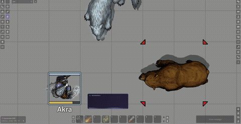
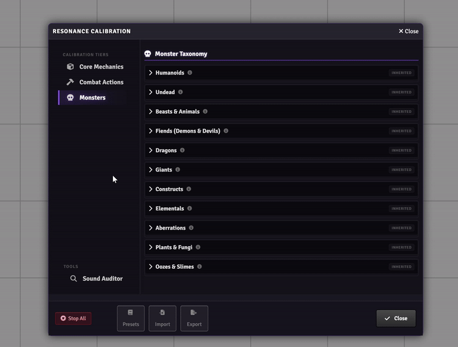
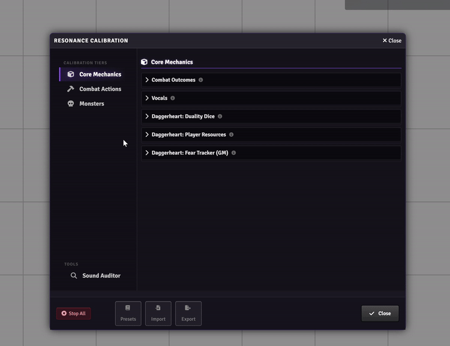

# Ionrift Resonance

**Automated audio triggers for Foundry VTT.**

Triggers sound effects based on chat messages, mechanics, and combat workflows. Supports **[Daggerheart](https://foundryvtt.com/packages/daggerheart)** (native support) and **DnD5e** (via Midi-QOL). Ships with local sound files (WAV/MP3). Optionally integrates with **Syrinscape** for cloud audio.

### Demo

*Full DnD5e combat sequence: melee, ranged, spells, and AoE. All sounds triggered automatically.*

<table>
<tr>
<td width="50%">
<h3>Ranged Attack</h3>

<em>Bow draw, arrow impact, pain vocal</em>
</td>
<td width="50%">
<h3>Creature Attack</h3>

<em>Claw swipe, Sacred Flame, spell impact</em>
</td>
</tr>
<tr>
<td width="50%">
<h3>Melee Combat</h3>

<em>Sword swing, hit, damage</em>
</td>
<td width="50%">
<h3>Fireball (AoE)</h3>

<em>Spell cast, explosion, multi-target damage</em>
</td>
</tr>
</table>

## Quick Start

1. Install from Foundry VTT package manager
2. Install **Ionrift Library** (required dependency)
3. Open **Game Settings > Module Settings > Ionrift Resonance**
4. Click **Open Attunement Protocol** (not the Library's "Begin Attunement", that's for creature indexing)
   - **Local sounds?** Leave the Syrinscape token blank and click Verify to proceed in Local-Only mode
   - **Syrinscape?** Paste your auth token to connect cloud audio
5. Select the **Ionrift SFX Pack** preset. ~400 sounds activate immediately.

For detailed walkthrough, troubleshooting, and FAQ see the **[Setup: Resonance](https://github.com/ionrift-gm/ionrift-library/wiki/2-Setup-Resonance)**.

## Per-Actor & Per-Item Sound Overrides

Every actor and item sheet includes a **Sounds** button (header or overflow menu). Click it to:

- **Assign custom attack/spell sounds** to specific items (e.g. "Flaming Longsword" to fire impact)
- **Override PC pain/death vocals** per character (Masculine/Feminine identity selection)
- **Configure monster-specific sounds** (e.g., Dragon breath attack)
- **Set actor-wide defaults** that apply to all their items

**Examples:**
- Assign a unique roar to a specific Dragon NPC
- Give "Elric's Stormblade" a custom thunder impact sound
- Override generic pain sounds with character-specific voice lines

Custom bindings always take priority over global presets.

## Ionrift SFX Pack

Resonance ships with **~400 local sound files** covering the full combat loop. Select **"Ionrift SFX Pack"** in the Attunement Protocol or Module Settings to activate.

| Category | Sounds | Examples |
|----------|--------|----------|
| Combat (hits, misses, crits) | 35 | Melee impacts, magic hits, ranged strikes, whooshes |
| Weapons | 50+ | Sword slashes, bow draws, claw swipes, bludgeon swings, tentacles |
| Monsters | 70+ | Bear, beast, construct, demon, dragon, goblin, undead, wolf |
| Monster Deaths | 20+ | Generic + type-specific death sounds |
| PC Vocals | 40+ | Pain and death vocals (masculine / feminine) |
| Spells | 50+ | Fire, ice, lightning, necrotic, radiant, thunder, void |
| Stingers | 40+ | Crits, fumbles, success/fail outcomes, Hope/Fear (Daggerheart) |

All sounds are local MP3 files included in the module.

## Features
*   **Duality Dice Support**: Hooks into Daggerheart roll mechanics.
    *   **Fear**: Dark/tense sounds when Fear interacts with the roll.
    *   **Hope**: Heroic sounds when Hope wins.
    *   **Criticals**: Sound cues for rolling doubles.
*   **Contextual Triggers**:
    *   **Damage**: Blood splat sounds when actors take damage.
    *   **Death**: Death sounds when HP drops to 0.
    *   **Misses**: Whoosh or failure sounds on missed attacks.
*   **Smart Matching**: Picks sounds based on weapon names (Sword, Dagger, Bow) or spell keywords (Fire, Ice, Void).
*   **Per-Item Overrides**: Bind specific sounds to individual items (attack, hit, miss, equip, unequip). Takes priority over all presets.
*   **Per-Actor Overrides**: Set pain, death, spotlight, and system-specific sounds per character or creature.
*   **Mute Toggle** *(v2.3.0)*: Silence individual event keys in the Calibration UI without removing the preset. Blocks the full fallback chain.

For a full breakdown of how these interact, see the **[Features Reference](docs/FEATURES.md)**.

## Resonance Calibration

### Sound Picker

  
*Search, preview, and select sounds. Supports local files and Syrinscape.*

### Tier Navigation

  
*Browse tier tabs, expand categories, assign sounds to keys.*

Configuration UI for mapping game events to sound bindings (local file paths or Syrinscape element IDs).

Open it via **Module Settings -> Ionrift Resonance -> Resonance Calibration**.

### Tier 1: Core Events
The base sounds: crits, misses, PC death sounds.
*   **Tip**: Use the picker's multi-select (Ctrl+Click) to assign multiple sounds for randomized playback.

### Tier 2: Categories
Configure sounds for broad categories like specific Weapon types (Axes, Bows, Swords) and Magic Schools (Fire, Ice, Necrotic).

### Tier 3: Monsters
Assign default sounds to creature families. Actors are classified automatically (e.g. "Zombie Shambler" matches the Zombie family).

### Players Tab
Define specific pain and death sounds for your Player Characters.
*   **Pain ID**: Plays when the character takes damage.
*   **Death ID**: Plays when the character drops to 0 HP / dies.

### Orchestrator
Sound budgets and timing offsets. Budgets prevent the same sound category from stacking when multiple triggers fire at once (e.g. a Fireball hitting four targets). Offsets control the delay between layered sounds in the two-beat attack sequence (swing, then impact). Defaults are tuned for the SFX Pack.

### Sound Auditor
Scans the world for items with Ionrift sound flags set. Shows which slots are bound per item and lets you open or clear them. Access it from the tools area inside the Calibration UI.

See **[Features Reference](docs/FEATURES.md)** for full detail on all tabs and controls.

## Data Management
*   **Export JSON**: Back up your config to a JSON file via the **Export JSON** button in the calibration footer.
*   **Local Files**: Place WAV/MP3 files anywhere in your Foundry Data folder (e.g. `sfx/`) and bind them directly.
*   **Syrinscape Token** (optional): If using Syrinscape cloud sounds, enter your Auth Token in Module Settings.

## Dependencies
*   **[Ionrift Library](https://github.com/ionrift-gm/ionrift-library)** - Required.
*   **[Midi-QOL](https://foundryvtt.com/packages/midi-qol)** - Required for DnD 5e.

### Optional Integrations
*   **[Syrinscape](https://syrinscape.com/)** - Cloud-hosted sound library.
*   **[fvtt-syrin-control](https://github.com/frondeus/fvtt-syrin-control)** - Embeds the Syrinscape player in Foundry.

### Recommended Modules
These are not required but significantly improve the experience:

*   **[Dice So Nice](https://foundryvtt.com/packages/dice-so-nice)** - 3D dice add a natural pause between the attack roll and result, giving sounds room to breathe.
*   **[Automated Animations](https://foundryvtt.com/packages/autoanimations)** - Spell and attack animations create timing gaps so sounds don't overlap.

## Supported Systems

### 1. Daggerheart
**Native Support**. No external modules required (other than core dependencies).

**Setup:** Enable automation in Daggerheart system settings for sound triggers to work properly:
- Open **Game Settings > Daggerheart > Roll Tab > Automation Settings**
- Enable the **Roll** automation for GM and Players
- Enable **Apply Damage/Healing** automation for GM and Players

**Features:**
*   Sound triggers on Duality Dice rolls (Fear/Hope/Crit).
*   **Fear Tracker**: Dynamic sounds for GM Fear Gain (Thresholds 1-4, 5-8, 9+) and variable Spends.
*   **Resources**: Triggers for Hope Gain/Use and Stress Take/Clear.
*   Automatic chat card parsing.

#### Known Limitations (Daggerheart v0.5.x)
*   **Domain Resolution for Features**: The Daggerheart data model does not store per-feature domain metadata. When a class feature (e.g. "Sparing Touch") is used, Resonance falls back to the actor's class domains in order. The first domain with a bound sound is used. Override individual features using Tier 4 (Campaign Overrides) for precise control.

### 2. DnD 5e
**Requires [Midi-QOL](https://foundryvtt.com/packages/midi-qol)** for combat automation.

Without Midi-QOL, Resonance falls back to native DnD5e hooks which provide limited automation (attack rolls only, no damage/death detection).

**Supported Triggers:**
*   **Attacks**: Weapon swing, then hit/miss/crit result (two-beat sequence).
*   **Damage**:
    *   **Pain**: Configured pain sounds for PCs (Masculine/Feminine) and Monsters (classified by creature type).
    *   **Death**: Detects when HP drops to 0 and plays a death sound.
*   **Items**:
    *   **Weapons**: Matches Damage Type to sound (Slashing = Sword, Bludgeoning = Mace, etc.).
    *   **Spells**: Maps to Spell Schools (Evocation, Necromancy, etc.) and effect types (Fire, Ice, Void).
    *   **Specifics**: Tier 4 overrides work for any item name (e.g. override "Fireball" specifically).

#### Recommended: Midi-QOL Setup

For the best experience, Resonance works with Midi-QOL's **automated workflow**. This gives Resonance access to attack results, damage rolls, and target HP changes.

**Recommended Midi-QOL Workflow Settings:**
1.  Open **Module Settings > Midi-QOL > Workflow Settings**.
2.  Set **Auto Roll Attack** and **Auto Roll Damage** to your preference. Resonance works with any setting.
3.  Enable **Auto Apply Damage** (or "Apply Damage to Target") so that HP changes fire the damage hook and trigger pain/death vocals.

> **Tip:** Dice So Nice and Automated Animations are particularly effective with DnD 5e, as they insert natural pauses between the weapon swing sound and the hit/miss result.

---

## Documentation

All setup guides, walkthroughs, and troubleshooting live in the **[Ionrift Library Wiki](https://github.com/ionrift-gm/ionrift-library/wiki)** - that's the single source of truth for the whole Ionrift ecosystem. The files in this repo (`README`, `docs/FEATURES.md`) are technical reference, not guides.

- **[Setup: Core Library](https://github.com/ionrift-gm/ionrift-library/wiki/1-Setup-Core-Library)** - Installation and creature indexing
- **[Setup: Resonance](https://github.com/ionrift-gm/ionrift-library/wiki/2-Setup-Resonance)** - Sound configuration and presets
- **[Resonance Calibration](https://github.com/ionrift-gm/ionrift-library/wiki/3-Resonance-Calibration)** - Fine-tuning sound bindings
- **[Advanced Diagnostics](https://github.com/ionrift-gm/ionrift-library/wiki/4-Advanced-Diagnostics)** - Manifest inspection and troubleshooting

## Bug Reports

If something isn't working:

1.  Check the **[wiki](https://github.com/ionrift-gm/ionrift-library/wiki)** for common fixes.
2.  Post to the **[Ionrift Discord](https://discord.gg/YmgdNNu4)** with your Foundry version, module versions, and any console errors (F12).
3.  Or open a **[GitHub Issue](https://github.com/ionrift-gm/ionrift-resonance/issues)**.

---

## License
MIT License. See [LICENSE](./LICENSE) for details.

