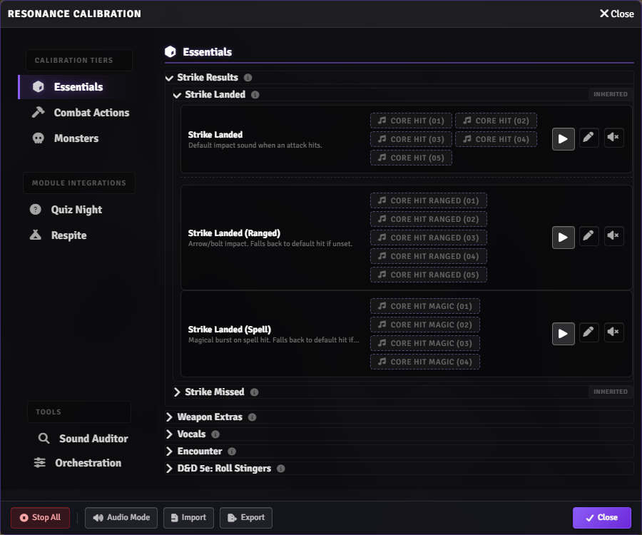
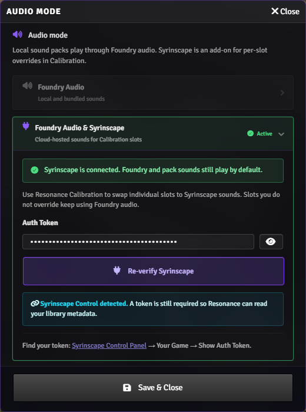
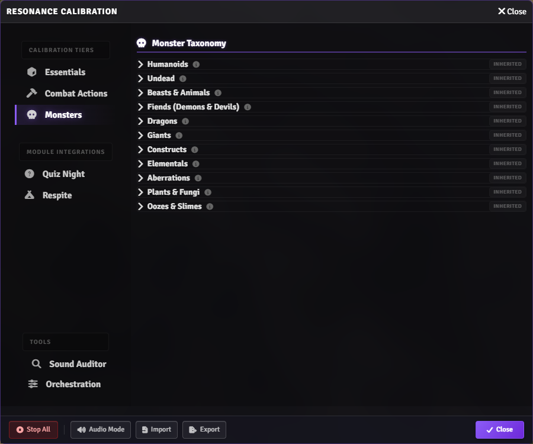

# Ionrift Resonance

**Automated combat sound effects, two-beat weapon choreography, and creature audio for Foundry VTT.**

### Support Ionrift

> Documentation, setup guides, and troubleshooting: **[Ionrift Wiki](https://github.com/ionrift-gm/ionrift-library/wiki)**

Resonance triggers contextual sound effects for melee strikes, ranged shots, spells, and creature abilities from local audio files or Syrinscape cloud playback.

---

## Core Capabilities

- **Two-Beat Attack Sequences.** Plays distinct audio for the attack action (swing, bow draw, spell cast) and resolution (impact, miss, spell burst, pain or death vocals). Timing offsets are adjustable in Orchestration.
- **11 Tabletop Systems.** Built-in support for Daggerheart, Pathfinder 2e, Starfinder, DnD 3.5e, Pathfinder 1e, Old-School Essentials, Call of Cthulhu 7e, SWADE, Warhammer Fantasy Roleplay 4e, Cyberpunk RED, and Blades in the Dark. DnD 5e integrates with Midi-QOL for automated combat workflows.
- **Cross-Module Audio Triggers.**
  - **Ionrift Respite:** Ambient campfire crackle, kindling ignition, stoking, whittling, and rest resolution cues.
  - **Ionrift Quiz Night:** Round start horns, countdown timer ticks, pencils down, answers, and ceremony fanfares.
- **Calibration UI & Sound Auditor.** Map game events across Core Essentials, Combat Actions, Spells, and Monsters. The Sound Auditor tool scans world items for lingering sound flags.
- **Multi-Sound Randomization.** Ctrl+Click in the Sound Picker to assign multiple sounds to a single key for varied playback.
- **Fallback Mute Controls.** Silence generic swing sounds (`CORE_WHOOSH`) without clearing item or actor presets.
- **Category Volume Sliders.** Independent volume attenuation for melee attacks, ranged weapons, spells, and interface audio.
- **Per-Actor & Per-Item Overrides.** Assign bespoke audio to specific weapons, unique monster abilities, and PC vocal lines (Masculine / Feminine presentation).

---

## Setup & Audio Mode

1. Install **Ionrift Library** and **Ionrift Resonance** from the package manager.
2. Open **Game Settings > Module Settings > Ionrift Resonance > Audio Mode**.
3. Choose your audio provider:
   - **Ionrift Local SFX:** Uses local audio files from `ionrift-data/overlays/ionrift-resonance/core/`.
   - **Syrinscape Web API:** Connects via your Syrinscape auth token for cloud audio.
   - **Custom / Manual:** Blank canvas for custom audio mappings.

---

## Calibration & Tuning

Open **Resonance Calibration** from Module Settings:

- **Tier 1 (Essentials):** Critical hits, fumbles, strike misses, and PC pain and death vocals.
- **Tier 2 (Combat Actions):** Weapon sound assignments (Slashing, Piercing, Bludgeoning, Bows) and Magic Schools (Fire, Ice, Lightning, Necrotic, Radiant).
- **Tier 3 (Monsters):** Creature family vocals and default attacks via Library creature taxonomy.
- **Integrations:** Dedicated sound triggers for Ionrift Respite and Ionrift Quiz Night.
- **Tools:** Sound Auditor item scanner and Orchestration timing controls.

---

## Supported Systems

- **Daggerheart:** Native support. Triggers on Duality Dice rolls (Fear, Hope, Criticals), Fear Tracker thresholds (1-4, 5-8, 9+), Hope and Stress resource changes.
- **DnD 5e:** Full automation via Midi-QOL (attack rolls, damage rolls, and automated HP-based pain and death vocals). Native DnD 5e fallback supports attack roll sounds.
- **Pathfinder 2e & Starfinder:** Native attack, spell, damage, and death triggers.
- **Expanded Systems:** Native sound hooks for DnD 3.5e, PF1e, OSE, Call of Cthulhu 7e, SWADE, WFRP 4e, Cyberpunk RED, and Blades in the Dark.

---

## Requirements & Optional Modules

- **[Ionrift Library](https://github.com/ionrift-gm/ionrift-library):** Required kernel dependency.
- **[Midi-QOL](https://foundryvtt.com/packages/midi-qol):** Required for DnD 5e damage and death automation.
- **[Dice So Nice](https://foundryvtt.com/packages/dice-so-nice)** (optional): 3D dice rolls introduce natural timing pauses between attack swings and results.
- **[Automated Animations](https://foundryvtt.com/packages/autoanimations)** (optional): Visual animations pair with audio cues.

---

## Bug Reports

1. Check the **[Ionrift Wiki](https://github.com/ionrift-gm/ionrift-library/wiki)** for common setup guides.
2. Post to the **[Ionrift Discord](https://discord.gg/vFGXf7Fncj)** with your Foundry version, module versions, and console output.
3. Open a **[GitHub Issue](https://github.com/ionrift-gm/ionrift-resonance/issues)**.

---

## License

Source code released under the [MIT License](./LICENSE).

---

**Part of the [Ionrift Module Suite](https://github.com/ionrift-gm)**

[Wiki](https://github.com/ionrift-gm/ionrift-library/wiki) · [Discord](https://discord.gg/vFGXf7Fncj) · [Patreon](https://patreon.com/ionrift)
