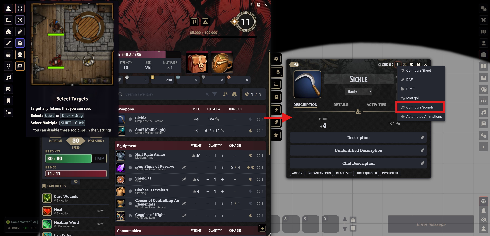
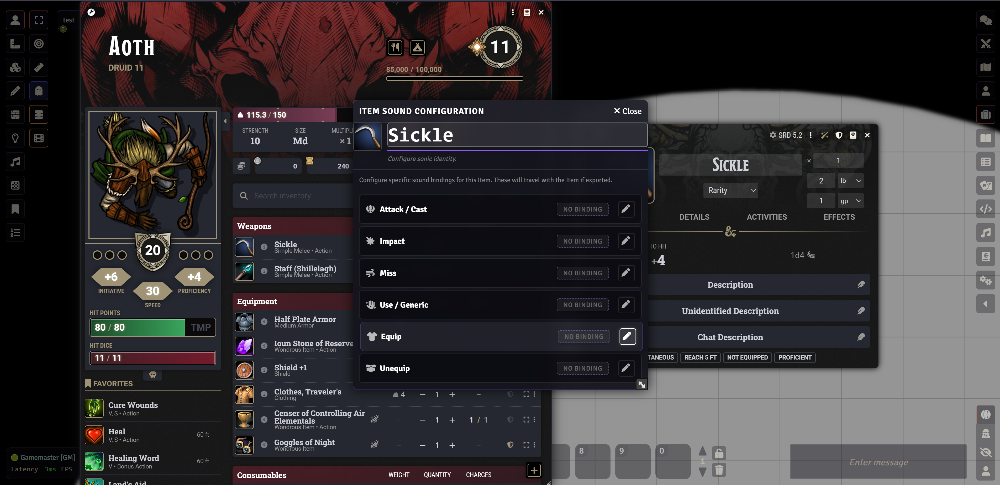
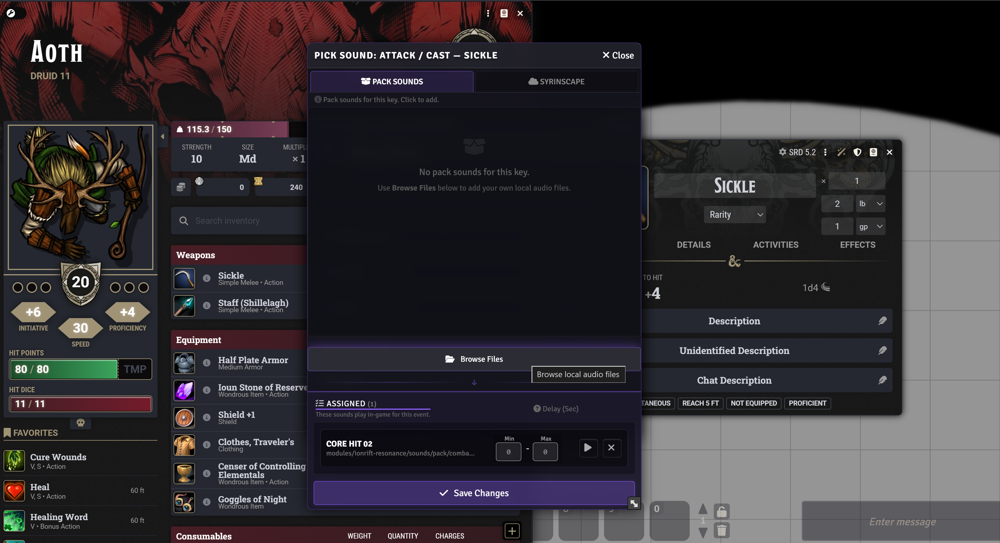
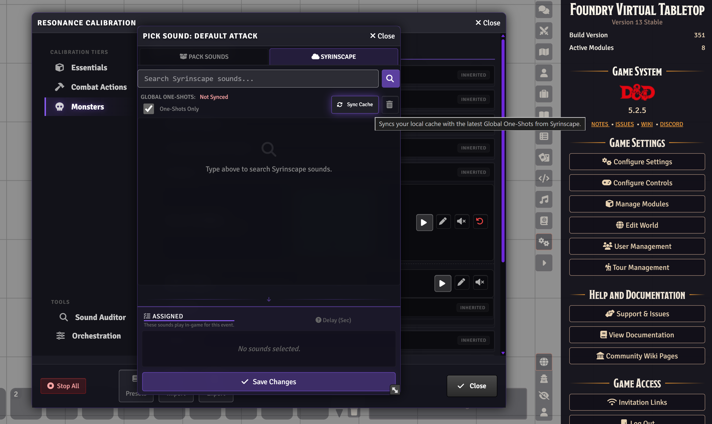
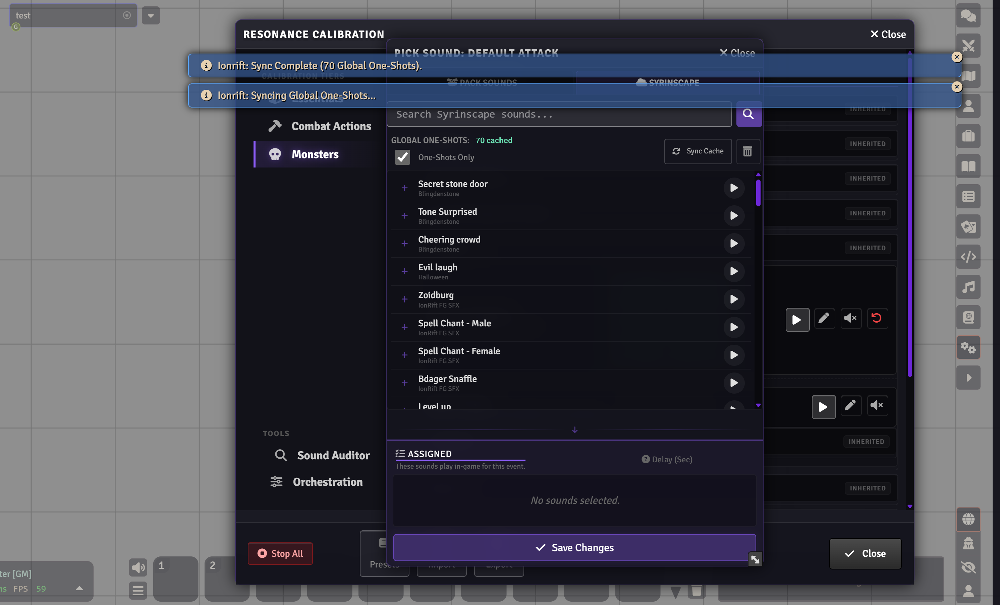
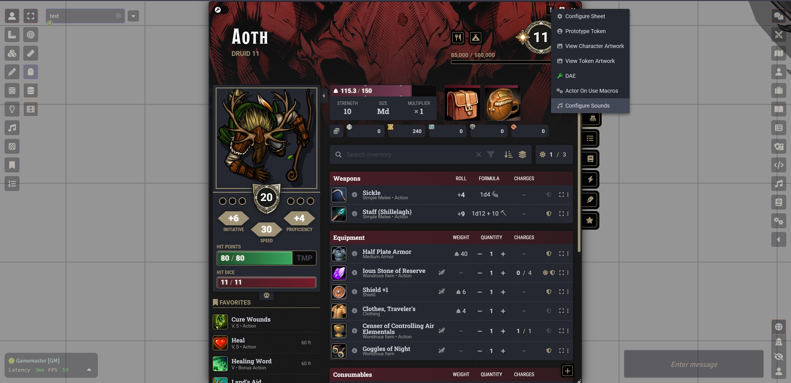

# Ionrift Resonance: Features

Detailed reference for all Resonance features. For setup and quick start, see the [README](../README.md).

---

## Sound Hierarchy

When an event fires (a sword swing, a spell cast, damage taken), Resonance works through a resolution chain to pick what plays. The first match wins.

```
1. Item flag          -- sound bound directly to this specific item
2. Adversary map      -- named creature overrides (e.g. "Adult Red Dragon" > BREATH)
3. Weapon/Spell name  -- name-matching against weapon type or spell school
4. Domain (DH only)   -- Daggerheart domain resolution (item domain > actor class domains)
5. Creature classifier -- Ionrift Library family classification (Bear, Undead, Demon...)
6. Calibration config -- your custom key bindings in the Resonance Calibration UI
7. Preset default     -- the SFX Pack or Syrinscape preset defaults
8. Fallback chain     -- ATTACK_SWORD > CORE_MELEE > CORE_WHOOSH > null
```

If the resolved value is `__MUTED__` at any point (see Mute Toggle below), the chain stops and nothing plays.

**What this means in practice:** if a bone devil's Claws item has no sound flag (step 1), and there's no adversary override for that actor (step 2), the name "Claws" doesn't match any weapon mapping (step 3), so it falls through to the creature classifier (step 5). If the classifier returns a generic result, it eventually falls back to `CORE_WHOOSH` - the generic swing. The fix is to set a flag at step 1 or step 2.

---

## Item Sound Overrides

Open via the **Sounds** button on any item sheet. The entry point is the item header overflow menu (the three-dot icon on the item sheet title bar).



This opens the **Item Sound Configuration** window for that specific item.



Six slots, each independent:

| Slot | When it plays |
|------|--------------|
| Attack / Cast | Phase 1 - the swing or cast moment, before the result |
| Impact | Replaces the default hit sound on a landed strike |
| Miss | Replaces the default whoosh on a miss |
| Use / Generic | Non-attack item use (potions, scrolls, consumables) |
| Equip | When the item is equipped |
| Unequip | When the item is removed |

Each slot has an edit button that opens the **Sound Picker**. Multi-sound randomization is supported - add multiple files to a slot and Resonance picks one at random on each trigger. Each assigned sound also has an optional delay range (Min/Max in seconds) for timing variation.

### The Sound Picker

The Sound Picker has two tabs: **Pack Sounds** and **Syrinscape**.

**Pack Sounds tab** - lists curated sounds from the Ionrift SFX Pack. Browse by category, preview before assigning, and add with a single click. The **Browse Files** button at the bottom opens the Foundry file picker so you can assign any local audio file on your server.



The **Assigned** tray at the bottom shows all sounds currently bound to this slot. Each entry has a Min/Max delay range, a preview button, and a remove button.

**Syrinscape tab** - connects to your Syrinscape Online account. The first time you open this tab the cache will show "Not Synced".



Click **Sync Cache** to pull the Global One-Shots list from Syrinscape. Once synced the count updates and the full list populates.



Type in the search bar to filter by name. Hover any result to preview. Click the `+` icon to add it to the Assigned tray. Your Syrinscape API key is set in the Resonance module settings.

**Typical uses for item overrides:**
- Silence a bone devil's generic swing by setting Attack to mute on the Claws item, rather than muting `CORE_WHOOSH` globally
- Give a specific legendary weapon a unique impact sound
- Add an equip/unequip sound to armor and weapons for immersion

Item flags take highest priority in the resolution chain, so they always win over presets and Calibration overrides.

---

## Actor Sound Overrides

Open via the **Sounds** button on any actor sheet. The entry point is the actor header overflow menu (the three-dot icon on the character sheet title bar).



**Shared slots (all systems, all actor types):**

| Slot | When it plays |
|------|--------------|
| Vocal (Pain) | When this actor takes damage |
| Vocal (Death) | When HP drops to 0 |

**DnD5e:**

| Slot | When it plays |
|------|--------------|
| Your Turn | Spotlight fanfare at the start of this actor's turn |

**Daggerheart:**

| Slot | When it plays |
|------|--------------|
| Hope Gained | When this character gains a Hope token |
| Hope Spent | When this character spends Hope |
| Stress Marked | When this character takes Stress |
| Stress Cleared | When this character clears Stress |
| Your Turn | Spotlight fanfare at the start of this actor's turn |

Actor flags override Calibration config for that specific actor. Useful for giving a specific NPC a unique death sound, or a PC a distinctive pain vocal, without touching anything else.

---

## Identity / Voice

The actor config includes a **Voice** selector (Masculine / Feminine). This maps to vocal register and controls which pool of pain and death vocals the module draws from for PCs. It does not affect NPCs or monsters - those use the monster vocal chain regardless of this setting.

Both pools are included in the SFX Pack. The selector can be changed at any time and takes effect immediately on next trigger.

---

## Mute Toggle

Added in v2.3.0. Available on every row in the Resonance Calibration UI.

Click the speaker icon on any sound row to mute that event key. When muted:
- The row dims and shows a red "MUTED" badge
- The fallback chain is blocked entirely - nothing plays for that event
- The mute state persists across reloads

Click the icon again to unmute and restore inherited behaviour.

Useful for silencing events you don't want (e.g. a specific stinger, or a generic fallback) without having to delete the preset or restructure the key bindings.

---

## Sound Auditor

Accessible from the tools area inside the Resonance Calibration UI.

The Auditor scans the entire Foundry world and lists every item that has Ionrift sound flags set. For each item it shows:
- Item name and owning actor (if it's an actor-owned item vs a world item)
- Which slots are bound (Attack, Impact, Miss, Use, Equip columns)

Actions per row:
- **Open** - opens the item sheet directly
- **Clear** - removes all Ionrift sound flags from that item after confirmation

The Auditor also scans unlinked tokens present in the active scene - so stage items and encounter-specific actors are included, not just world items.

Useful after importing compendium content (e.g. a bestiary pack someone else configured) to see what's pre-bound, or to audit a world before a campaign handoff.

---

## Orchestration

The **Orchestration** tab inside the Resonance Calibration UI controls how sounds are scheduled and layered.

**Sound Budgets**

Each sound category has a minimum gap in milliseconds before it can play again. If the same category fires twice within that window, the second one is dropped. This prevents pile-ups - e.g. a Fireball hitting four targets would normally queue four hit sounds; with a budget it plays one and drops the rest.

Set to 0 to disable limiting for a category.

**Timing Offsets**

Named offsets add a deliberate delay before specific sounds fire. The primary use case is the two-beat attack sequence: the swing sound plays at the action moment, and the impact/pain sound plays slightly after. Tuning the offset changes how that sequence feels.

Defaults are tuned for the SFX Pack. Modules like Dice So Nice and Automated Animations already add natural pauses, so offset values often need to be smaller when those are active.

Reset individual categories/offsets or reset all to defaults via the buttons in the tab footer.
